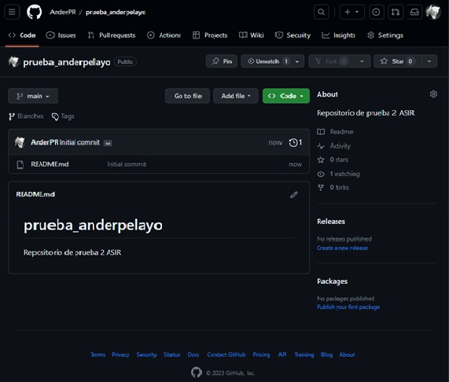
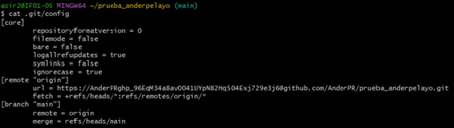
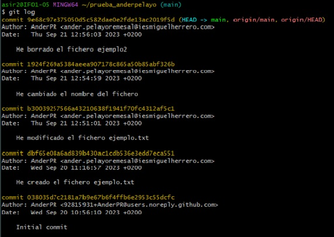
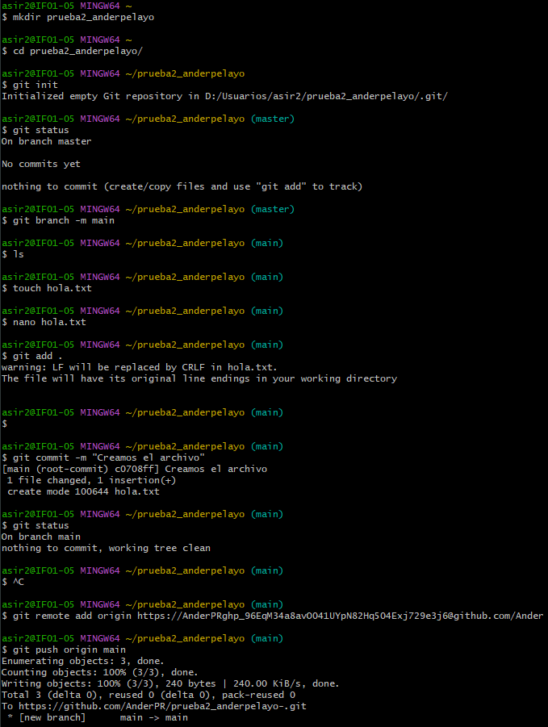

# Taller 1
## Ejercicio 1 - 2 - 3
### 1.1 Mostrar Repositorio
  En este taller vamos a crear un repositiorio en github y lo conectaremos con el repositorio local.  
  Lo primero que hacemos es crear el repositorio en el GitHub.

  

  

### 1.2 Mostrar archivo config
  Ahora mostraremos el contenido del archivo `.git/config`

  

  

### 1.3 Mostrar todos los commit
  Mostraremos los commit realizados durante la actividad realizada.

  

## Ejercicio 4

### 1 Creacion del repositorio

   Lo primero que hacemos es crear el repositorio en local con un `mkdir` , una vez creado el repositorio entramos dentro de él `cd`.   
   Posteriormente creamos un archivo dentro del directorio en este caso el archivo sera "hola.txt", posteriormente lo editamos.   
   Realizados estos pasos lo siguiente sera ejecutar un `git add .` , y posteriormete realizaremos un `commit -m` y le escribimos un mensaje.   
   Finalmente lo que nos queda es conectar el repositorio local con el repositorio de GitHub, que para esto tendremos que crear primero tendremos que crearle en GitHub. Le tendremos que crear vacio.   
   Creado el repositorio lo conectaremos mediante el token y el comando `git remote add` , finalmente haremos un `git push origin main` 

   Finalmente creamos un archivo "pueba", le editamos para subir al repositorio remot y comprobar el funcionamiento.

  
