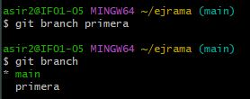
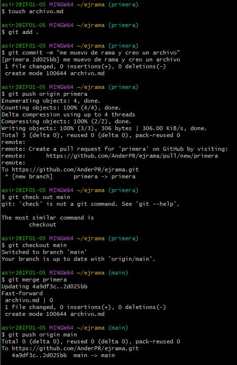

# Creacion de ramas

## Ander Pelayo

En este taller vamos a realizar una practica con ramas, a continuacion realizaremos la practica.   

El primer paso que tenemos que realizar es la creacion de la rama para eso usaremos el comando.   

    git branch "rama"

Tambien nos tendremos que situar en la rama creada. 

    git checkout "rama"

Y si queremos ver las ramas que tenemos creadas las podremos ver con el siguiente comando.   

    git branch

Ahora crearemos un archivo, y subiremos el archivo al repositorio con los siguiente comandos.      

    git add .
    git commit -m "mensaje de comit"
    git push origin "rama"

Una vez realizado este paso juntaremos las ramas con el siguiente comando.   

    git merge "rama"

Y finalmente subiremos los cambios a la rama MAIN tambien.  

    git push origin main

Ahora se nos pide borrar la rama creada para crear otra y generar un error en el archivo creado en pasos anteriores, a continuacion veremos el borrado de la rama.   

Una vez creada la otra rama nos situaresmos en la rama nueva y modificaremos una linea del archivo para posteriormente crear un complito y aprender a solucionarlo, para ver que hemos creado un comflicto realizaremos el siguiente comando para visionar el archivo, este paso lo tendremos que realizar tras hacer el `merge`.  

    cat archivo.md

Aqui podemos observar que el propio archivo nos a generado distintas opciones dentro del mismo archivo las cuales seremos nosotros quien escojera la opcion correcta.

   

Posteriormente tendremos que editar el archivo y le visionaremos con el mismo comando del paso anterior. Finalmente tendremos que subirlo de forma corregida al repositorio realizado los comandos siguientes.   

    git add .
    git commit -m "mensaje"
    git push origin main

   

Por ultimo tras realizar la sincronizacion con el repositorio remoto iremos a GitHub y veremos las ramas que tiene el repositorio.

