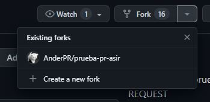
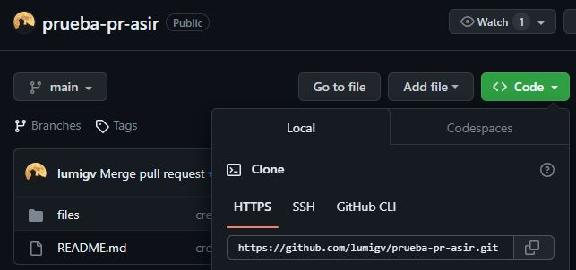
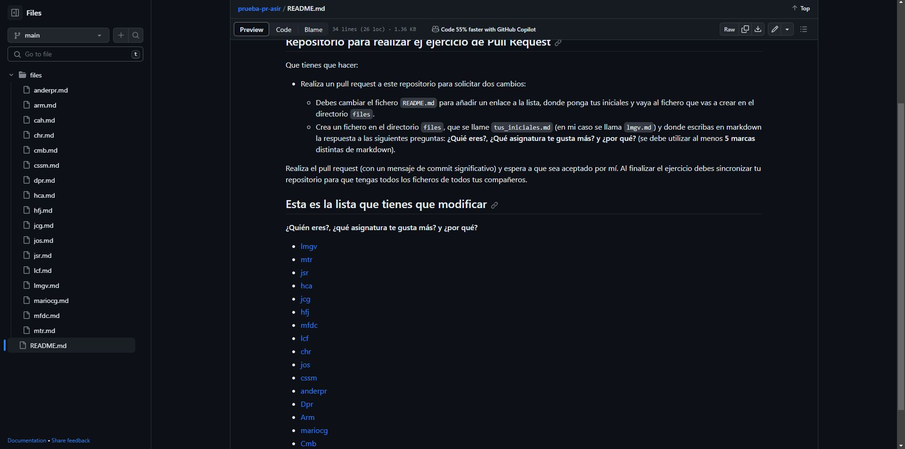

# Taller 4

## Ander Pelayo Remesal

Para realizar el pull reques lo primero que tendremos que hacer es un fork en el repositorio de la persona al que se le queremos hacer   

   

Una vez realizado el fork el siguiente paso sera clonar el repositorio para ello usaremos el comando   

    git clone "url del repositorio"

Realizada la clonacion del repositorio tendremos que crear la rama y modificar el fichero en la rama creada.   
Para crear la rama usaremos el comando

    git branch "nombre de rama nueva"

Para cambiarnos de rama se usara el siguiente comando   

    git checkout "nombre de rama nueva"

Cuando estemos situados en la rama nueva el siguiente paso que tendremos que realizar es la modificacion del archivo que se nos pide o el archivo que queremos modificar.   
Tras la realizacion de la modificacion tendremos que realizar un commit para posteriormente subir los cambios para que el autor del repositorio nos acepte o no las modificaciones propuestas.   

    git commit -m "Mensaje de commit"

Finalmente tras realizar el commit tendremos que subirlo con un   

    git push origin "rama"

Finalmente tras hacer estos pasos tendremos que ir al repositorio a GitHub y pulsar en el boton de Pull Reques, para que al autor.   
El ultimo paso seria sincronizar nuestra rama con la del repositorio original, cuando el autor haya aceptado los Pull Reques por lo que finalmente quedaria de la siguiente manera.   

